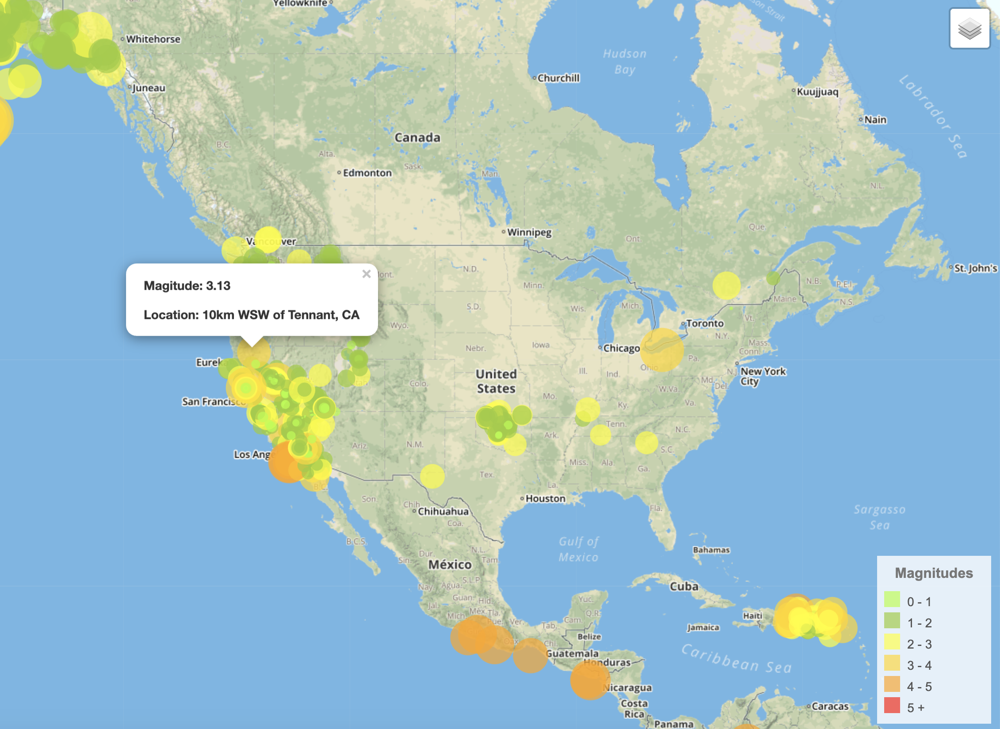
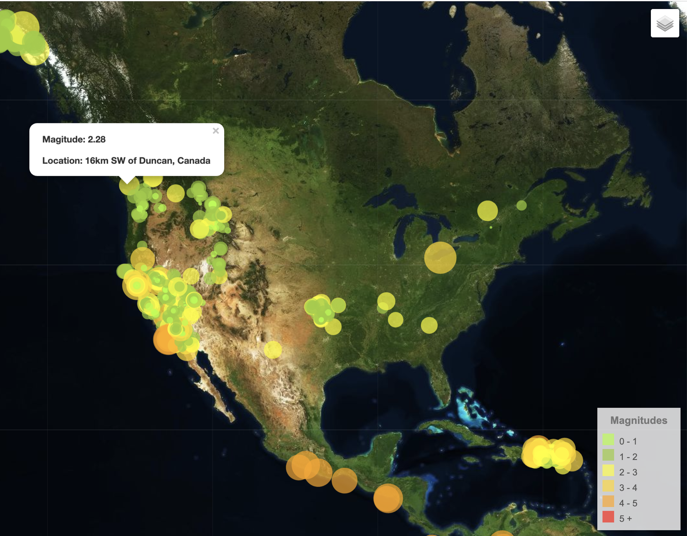

# Visualizing Earthquake Data with Leaflet

https://tinahuangyt.github.io/Leaflet-Earthquake_mapping/

Earthquake data from the past 7 days is updated in real-time.

## Background

The goal of this project is to visualize USGS earthquake data using Leaflet.js. 
The USGS provides earthquake data in a number of different formats, updated every 5 minutes. At the [USGS GeoJSON Feed](http://earthquake.usgs.gov/earthquakes/feed/v1.0/geojson.php) site, we retrieve earthquake data from the past 7 days to visualize and plot all the earthquakes based on their longitude and latitude. Data markers reflect the magnitude of earthquake in size and color. Popup is also included to provide additional information about the earthqake when a marker is clicked. Map is avilable in two formats: light map and satellite map.

Tools used in this visualization:
* Leaflet.js
* Javascript
* CSS

Output figure:

